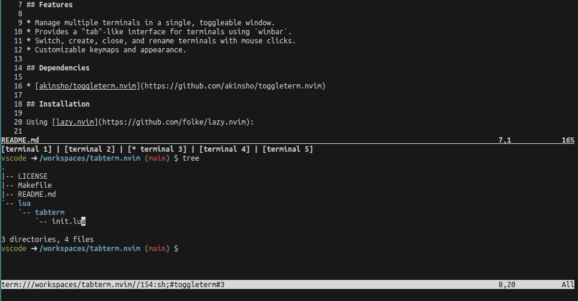

# tabterm.nvim

A Neovim plugin that extends [toggleterm.nvim](https://github.com/akinsho/toggleterm.nvim) to provide a **tab-like terminal management experience** using `winbar`.



## Features

* Manage multiple terminals in a single, toggleable window.
* Provides a "tab"-like interface for terminals using `winbar`.
* Switch, create, close, and rename terminals with mouse clicks.
* Customizable keymaps and appearance.

## Dependencies

* [akinsho/toggleterm.nvim](https://github.com/akinsho/toggleterm.nvim)

## Installation

Using [lazy.nvim](https://github.com/folke/lazy.nvim):

```lua
{
    "goropikari/tabterm.nvim",
    dependencies = { "akinsho/toggleterm.nvim" },
    opts = {
        require("tabterm").setup({
            shell = vim.o.shell or 'bash',    -- default shell
            height = 0.4,      -- split height ratio
            keymap = {
                toggle = "<C-t>", -- toggle terminal window
                add = "<C-n>",    -- add new terminal
            },
        })
    },
}
```

## Usage

* Toggle terminal window: Ctrl + t (default)
* Add a new terminal: Ctrl + n (default)
* Click actions on winbar:
  * Left click → switch to terminal
  * Middle click → close terminal
  * Right click → rename terminal

## License

MIT

